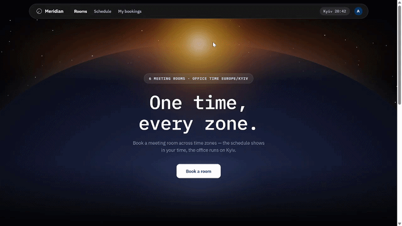
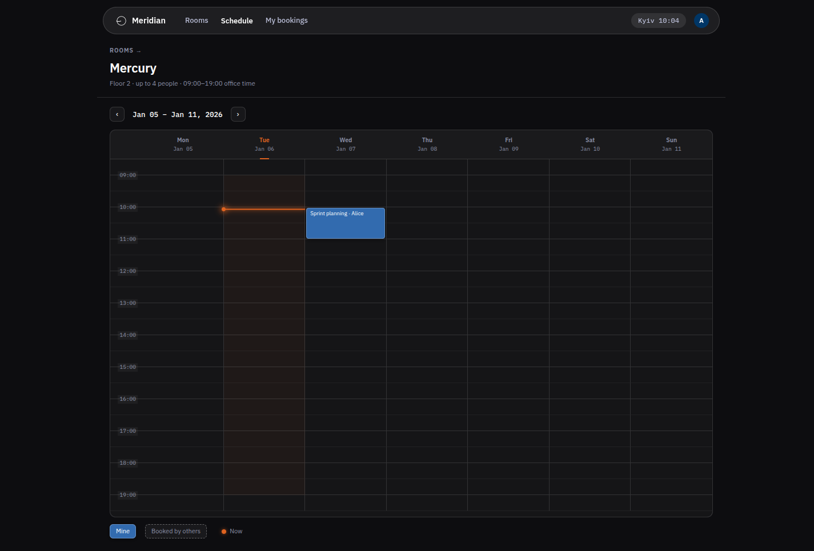
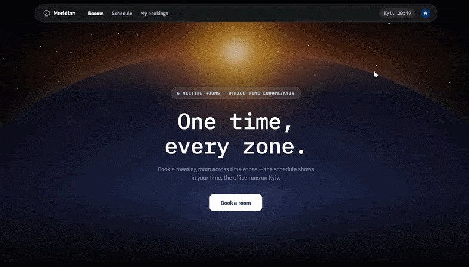
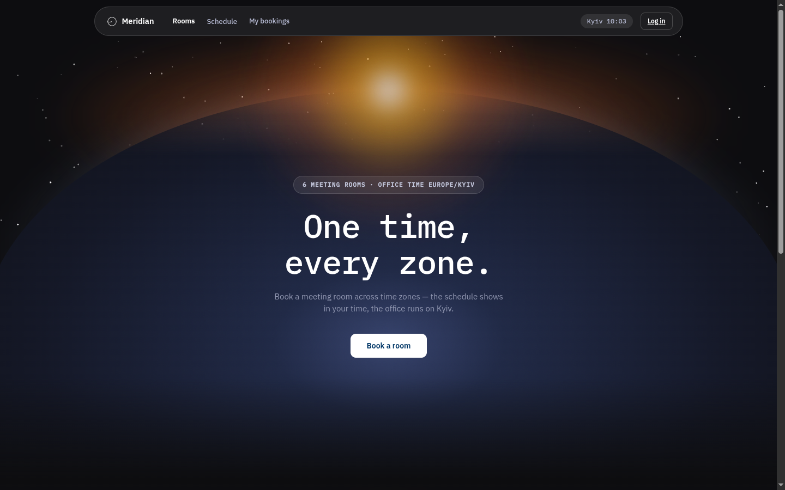
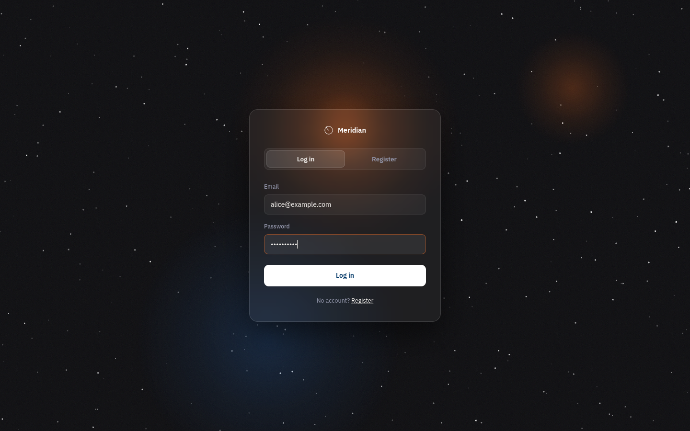
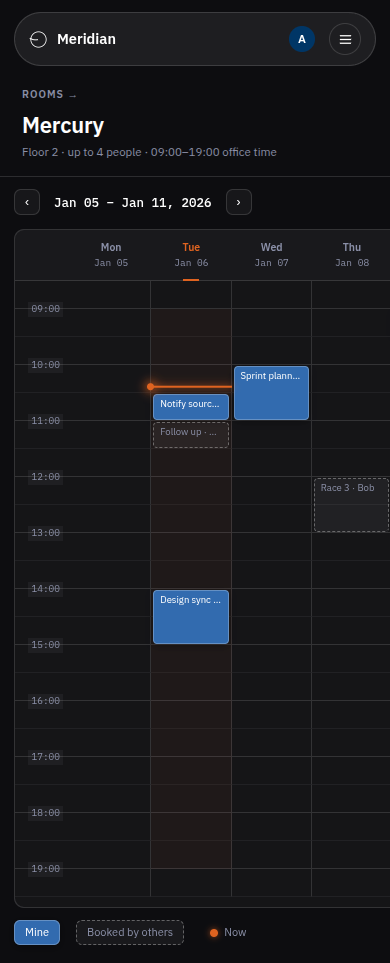

# Meeting Rooms

A small office meeting-room booking app. Open a room's weekly schedule, see
occupied slots, and book free time — in your own timezone.

UA-Skills event2 contest entry.


<p align="center">
  
  <br>
  <em>Booking flow — 25-second walkthrough</em>
</p>


## Table of Contents

- [The Problem](#the-problem)
- [Key Features](#key-features)
- [Tech Stack](#tech-stack)
- [API](#api)
- [Project Structure](#project-structure)
- [Getting Started](#getting-started)
- [Process & Learnings](#process--learnings)
- [Future Ideas](#future-ideas)
- [License](#license)

## The Problem

### Why I Built This

Offices book meeting rooms the old way — Slack ping-pong, a paper schedule on
the door, "who took 10:00 on Tuesday?". Nobody owns a room list, and nobody
sees the full picture until they're standing in front of a locked door.

This is my entry for the **UA-Skills event2** junior contest: a small app that
replaces the paper schedule with a weekly grid everyone can read, and lets
anyone book a free slot in seconds.

### The Solution

Open a room, see the week, pick a free 30-minute slot. The grid shows every
booking with its author, in **your** timezone — a user in Berlin sees the same
Kyiv schedule shifted by their offset. Own bookings can be cancelled; other
people's can't, not even via a direct API call.

**The hard part: a booking that can't double-book.**

The overlap check is part of the INSERT itself — one atomic SQL statement:

```sql
INSERT INTO bookings (...) SELECT ...
WHERE NOT EXISTS (SELECT 1 FROM bookings
                  WHERE room_id = ? AND start_at < ? AND end_at > ?);
```

Two users hitting the same slot at the same moment: exactly one row lands,
the second insert affects 0 rows and gets a 409. No locks, no transactions to
forget — the race protection *is* the statement.

## Key Features

- **Weekly grid per room** — Google Calendar-style, days across, time down,
  30-minute slots, week navigation back and forth

  <p align="center">
    
  </p>

- **Timezone-aware** — times stored as UTC instants, rendered in the
  browser's timezone; working hours (09:00–19:00) validated in Europe/Kyiv on
  the server; 30-minute alignment checked on UTC minutes, so it stays
  DST-safe
- **Atomic race protection** — see above; the loser of a simultaneous booking
  gets a clear 409
- **Recurring weekly bookings** — "every week, N times" (2–52), cancel the
  whole series or a single occurrence, turn a one-off into a series or extend
  it from "My bookings"
- **End-of-booking notifications** — when the next slot in the room is taken,
  the current author gets an in-app toast `NOTIFY_BEFORE_MINUTES` (default
  10) before it ends; delivered alerts are recorded, so each notification
  fires exactly once
- **Dev-mode email verification** — the confirmation link is printed to the
  server log, no SMTP needed; booking is blocked until verified
- **Capacity filter** — the room picker filters by minimum seats
- **My bookings page** — upcoming (with cancel) and past (paginated), each
  row links back to its room's grid
- **Mobile-friendly** *(partial)* — a collapsible menu and stacked booking
  rows on narrow screens; the weekly grid itself stays desktop-oriented

### Screens

<p align="center">
  
  <br>
  <em>The landing</em>
</p>

<p align="center">
  
  
  <br>
  <em>Landing and sign-in</em>
</p>

<p align="center">
  
  <br>
  <em>The same grid on a phone</em>
</p>

## Tech Stack

- **Frontend:** React 19 + Vite 8 + TypeScript, hand-written CSS (no UI kit)
- **Backend:** Express 5 + TypeScript, zod request validation
- **Database:** SQLite via better-sqlite3 — the atomic INSERT *is* the race
  protection
- **Auth:** JWT in an httpOnly cookie, bcrypt password hashing,
  express-rate-limit on login/register
- **Tests:** Vitest + supertest (`npm test`)
- **Deploy:** one Docker image — Express serves the built SPA and the API
  from the same origin (no CORS); SQLite in a named volume, auto-seeded

## API

| Method | Path | Auth | Description |
|---|---|---|---|
| POST | `/api/auth/register` | — | Register (name, email, password) |
| POST | `/api/auth/login` | — | Log in, sets the JWT cookie |
| GET | `/api/auth/verify` | — | Confirm email (dev: link in server log) |
| POST | `/api/auth/logout` | — | Clear the session |
| GET | `/api/auth/me` | ✓ | Current user |
| GET | `/api/rooms?capacity=N` | — | List rooms, optional min-capacity filter |
| GET | `/api/rooms/:id/bookings` | — | Bookings for a room |
| GET | `/api/bookings` | ✓ | My bookings (upcoming / past) |
| POST | `/api/bookings` | ✓ | Create a booking or a weekly series |
| DELETE | `/api/bookings/:id` | ✓ | Cancel own booking |
| POST | `/api/bookings/:id/repeat` | ✓ | Turn a booking into a weekly series |
| DELETE | `/api/bookings/series/:seriesId` | ✓ | Cancel a whole series |
| GET | `/api/bookings/notifications` | ✓ | Pending end-of-booking alerts |

## Project Structure

```
meeting-rooms/
├── backend/                # Express 5 API + SQLite
│   └── src/
│       ├── routes/         # auth, rooms, bookings
│       ├── services/       # bookingService, bookingValidation,
│       │                   # notificationService, scheduleRange
│       ├── middleware/     # auth, rateLimit, errorHandler
│       └── test/           # unit + API integration tests
├── frontend/               # React 19 + Vite SPA
│   └── src/                # pages, weekly grid, API client
├── Dockerfile              # builds both workspaces, serves SPA + API
├── docker-compose.yml      # one-command run
└── package.json            # npm workspaces (backend + frontend)
```

## Getting Started

Prerequisites: Node.js 22+ and npm 10+.

```bash
npm install
npm run dev
```

- Frontend: http://localhost:3000
- API: http://localhost:8080 — health check: `GET /api/health`

Both apps start from one command; the Vite dev server proxies `/api` to the backend.

### Docker

One command brings up the whole app — API, SPA and a seeded SQLite database:

```bash
docker compose up --build
```

- App: http://localhost:3000 (the API lives on the same origin — no CORS setup)
- The SQLite database lives in a Docker volume and is seeded automatically on
  first start (6 rooms, test users, demo bookings) — no manual steps
- Reset the data: `docker compose down -v && docker compose up --build`

### Configuration

All settings live in environment variables with safe defaults. To override,
copy `backend/.env.example` to `backend/.env` and adjust:

| Variable | Default | Purpose |
|---|---|---|
| `PORT` | `8080` | API port |
| `JWT_SECRET` | `dev-secret-change-me` | Secret for signing session cookies |
| `DB_PATH` | `./data/meeting-rooms.db` | SQLite database file |
| `FRONTEND_URL` | `http://localhost:3000` | Origin the email-verify link redirects to |
| `NOTIFY_BEFORE_MINUTES` | `10` | Notify the booking author this many minutes before its end (when the next slot is taken) |

### Seeds

Creates 6 rooms (Mercury, Mars, Venus, Earth, Jupiter, Saturn), 2 test users
and demo bookings. Idempotent — safe to re-run.

```bash
npm run seed
```

### Test Users

| Name | Email | Password |
|---|---|---|
| Alice | `alice@example.com` | `alice12345` |
| Bob | `bob@example.com` | `bob12345` |

## Process & Learnings

- **Race safety belongs in the database, not the app** — the first instinct
  was a check-then-insert in the service, which races by construction. Moving
  the overlap check into the INSERT (`WHERE NOT EXISTS`) made double-booking
  impossible and deleted an entire class of code: no locks, no retry loops.
- **Timezone is a storage decision first** — store UTC instants, render in
  the browser, validate office hours in Europe/Kyiv on the server, and align
  slots on UTC minutes. Doing it in that order kept the whole feature
  DST-safe without a single timezone library call at the grid boundary
  (date-fns-tz handles Kyiv conversions).
- **One container, one origin, zero setup** — the single Docker image serves
  the built SPA and the API from the same origin (no CORS config), and the
  SQLite volume auto-seeds. The contest rule "must run from the README on a
  clean machine" forced this simplicity, and it turned out to be the right
  constraint.
- **The server is the source of truth** — every rule (ownership, working
  hours, overlap) is enforced in the API, not the form. The integration tests
  prove it: a direct request to cancel someone else's booking gets rejected,
  not just the button being hidden.

## Future Ideas

- [ ] Full mobile experience for the weekly grid (currently desktop-oriented
      with stacked rows on narrow screens)
- [ ] Edit/reschedule an existing booking
- [ ] Real SMTP email verification
- [ ] Admin panel for managing rooms (currently seed-only)
- [ ] CI pipeline (GitHub Actions)

## License

[MIT](LICENSE) © 2026 Polina Pozhytkova
